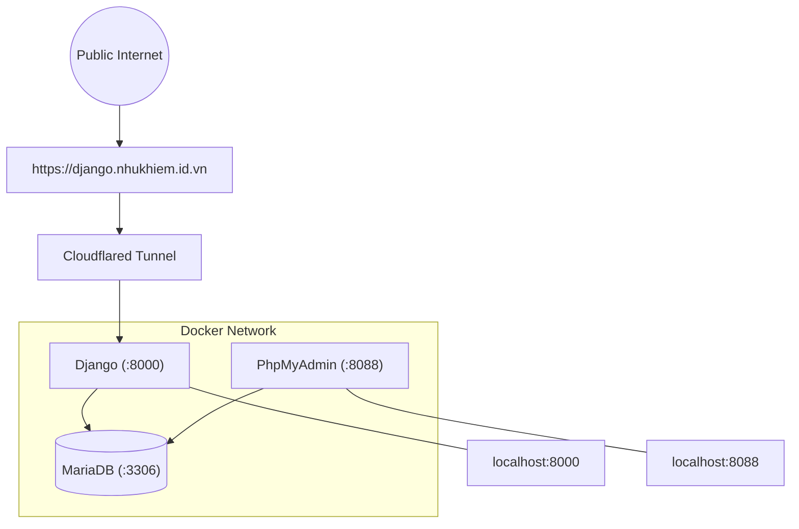

# 🏪 Hệ Thống Quản Lý Tiệm Cầm Đồ

> **Môn học:** Phát triển ứng dụng với mã nguồn mở-TEE0421  
> **Công nghệ:** Django · MariaDB · Docker · PhpMyAdmin · Cloudflare Tunnel  
> **Deadline:** 23h59 ngày 09/05/2026

---

## 📋 Mục Lục

1. [Giới thiệu](#1-giới-thiệu)
2. [Thiết kế CSDL](#2-thiết-kế-csdl)
3. [Kiến trúc hệ thống](#3-kiến-trúc-hệ-thống)
4. [Cấu trúc thư mục](#4-cấu-trúc-thư-mục)
5. [Hướng dẫn cài đặt](#5-hướng-dẫn-cài-đặt)
6. [Chi tiết các file](#6-chi-tiết-các-file)
7. [Hướng dẫn sử dụng](#7-hướng-dẫn-sử-dụng)
8. [Public với Cloudflare Tunnel](#8-public-với-cloudflare-tunnel)
9. [Kết quả demo](#9-kết-quả-demo)

---

## 1. Giới Thiệu

Hệ thống quản lý tiệm cầm đồ được xây dựng bằng **Django** (Python), chạy hoàn toàn trên **Docker** với 3 service:

| Service | Công dụng | Port |
|---|---|---|
| **MariaDB** | Lưu trữ toàn bộ cơ sở dữ liệu | 3306 |
| **PhpMyAdmin** | Giao diện xem/kiểm tra CSDL | 8088 |
| **Django** | Ứng dụng web chính | 8000 |

### Tính năng chính

- Quản lý khách hàng, nhân viên, hợp đồng cầm đồ, tài sản, lịch sử thanh toán
- Trang **Admin** tự động: thêm / sửa / xóa dữ liệu mọi bảng
- Khóa ngoại hiển thị dạng **dropdown chọn text** (Django tự xử lý)
- Trang chủ liệt kê **con nợ đến hạn chưa trả** (dùng template Jinja2)
- Public ra Internet qua **Cloudflare Tunnel** (không cần mua domain)

---

## 2. Thiết Kế CSDL

### 2.1 Sơ đồ quan hệ


# 2.2 Các bảng và quan hệ

```text
KhachHang ──────(1:N)──────► HopDong
NhanVien  ──────(1:N)──────► HopDong
TaiSan    ──────(1:N)──────► HopDong
HopDong   ──────(1:N)──────► ThanhToan
```

## Giải thích

* Một khách hàng có thể có nhiều hợp đồng cầm đồ
* Một nhân viên có thể xử lý nhiều hợp đồng
* Một tài sản thuộc một hợp đồng
* Một hợp đồng có thể có nhiều lần thanh toán

---

# 2.3 Mô tả chi tiết từng bảng

## 📌 Bảng `core_khachhang`

Lưu thông tin khách hàng đến cầm đồ.

| Trường       | Kiểu dữ liệu                | Mô tả             |
| ------------ | --------------------------- | ----------------- |
| `id`         | BIGINT (PK, Auto Increment) | Khóa chính        |
| `ho_ten`     | VARCHAR(100)                | Họ tên khách hàng |
| `cmnd`       | VARCHAR(20) UNIQUE          | Số CMND/CCCD      |
| `sdt`        | VARCHAR(15)                 | Số điện thoại     |
| `dia_chi`    | LONGTEXT                    | Địa chỉ           |
| `created_at` | DATETIME                    | Ngày tạo dữ liệu  |

---

## 📌 Bảng `core_nhanvien`

Lưu thông tin nhân viên trong tiệm cầm đồ.

| Trường       | Kiểu dữ liệu                | Mô tả            |
| ------------ | --------------------------- | ---------------- |
| `id`         | BIGINT (PK, Auto Increment) | Khóa chính       |
| `ho_ten`     | VARCHAR(100)                | Họ tên nhân viên |
| `sdt`        | VARCHAR(15)                 | Số điện thoại    |
| `chuc_vu`    | VARCHAR(50)                 | Chức vụ          |
| `created_at` | DATETIME                    | Ngày tạo dữ liệu |

---

## 📌 Bảng `core_taisan`

Lưu thông tin tài sản cầm cố.

| Trường        | Kiểu dữ liệu                | Mô tả              |
| ------------- | --------------------------- | ------------------ |
| `id`          | BIGINT (PK, Auto Increment) | Khóa chính         |
| `ten_tai_san` | VARCHAR(200)                | Tên tài sản        |
| `mo_ta`       | LONGTEXT                    | Mô tả chi tiết     |
| `tinh_trang`  | VARCHAR(50)                 | Tình trạng tài sản |

### Ví dụ tài sản

* Điện thoại
* Laptop
* Xe máy
* Vàng
* Máy ảnh

---

## 📌 Bảng `core_hopdong`

Đây là bảng nghiệp vụ chính của hệ thống.

| Trường          | Kiểu dữ liệu                | Mô tả               |
| --------------- | --------------------------- | ------------------- |
| `id`            | BIGINT (PK, Auto Increment) | Khóa chính          |
| `ngay_cam`      | DATE                        | Ngày cầm đồ         |
| `ngay_dao_han`  | DATE                        | Ngày đáo hạn        |
| `so_tien_vay`   | DECIMAL(15,0)               | Số tiền cho vay     |
| `lai_suat`      | DECIMAL(5,2)                | Lãi suất (%)        |
| `trang_thai`    | VARCHAR(20)                 | Trạng thái hợp đồng |
| `ghi_chu`       | LONGTEXT                    | Ghi chú             |
| `created_at`    | DATETIME                    | Ngày tạo hợp đồng   |
| `khach_hang_id` | BIGINT (FK)                 | Liên kết khách hàng |
| `nhan_vien_id`  | BIGINT (FK)                 | Liên kết nhân viên  |
| `tai_san_id`    | BIGINT (FK)                 | Liên kết tài sản    |

### Các trạng thái hợp đồng

```text
dang_cam  → Đang cầm
da_chuoc  → Đã chuộc
qua_han   → Quá hạn
```

---

## 📌 Bảng `core_thanhtoan`

Lưu lịch sử thanh toán của hợp đồng.

| Trường            | Kiểu dữ liệu                | Mô tả              |
| ----------------- | --------------------------- | ------------------ |
| `id`              | BIGINT (PK, Auto Increment) | Khóa chính         |
| `ngay_thanh_toan` | DATE                        | Ngày thanh toán    |
| `so_tien`         | DECIMAL(15,0)               | Số tiền thanh toán |
| `ghi_chu`         | LONGTEXT                    | Ghi chú            |
| `hop_dong_id`     | BIGINT (FK)                 | Liên kết hợp đồng  |

---

# 2.4 Quan hệ khóa ngoại (Foreign Key)

| Bảng             | Khóa ngoại      | Tham chiếu           |
| ---------------- | --------------- | -------------------- |
| `core_hopdong`   | `khach_hang_id` | `core_khachhang(id)` |
| `core_hopdong`   | `nhan_vien_id`  | `core_nhanvien(id)`  |
| `core_hopdong`   | `tai_san_id`    | `core_taisan(id)`    |
| `core_thanhtoan` | `hop_dong_id`   | `core_hopdong(id)`   |

---

## 3. Kiến Trúc Hệ Thống

---

## 4. Cấu Trúc Thư Mục

```
django-project/                  
│
├── docker-compose.yml              ← định nghĩa 3 service
├── .env                            ← chứa password, secret key (KHÔNG push lên git)
├── .gitignore                      ← bỏ qua .env, __pycache__, ...
├── README.md                       ← hướng dẫn (file này)
│
└── django/                         ← thư mục build Docker image cho Django
   ├── Dockerfile                  ← build image Python + Django
   ├── requirements.txt            ← danh sách thư viện pip
   │
   └── myshop/                   ← Django project (mount vào container)
       ├── manage.py
       ├── config/               ← Django config app
       │   ├── settings.py         ← cấu hình DB, INSTALLED_APPS, ...
       │   ├── urls.py
       │   └── wsgi.py│
       │
       └── core/                   ← app chính chứa nghiệp vụ
           ├── models.py           ← định nghĩa bảng CSDL
           ├── admin.py            ← đăng ký bảng vào trang admin
           ├── views.py            ← view home_page con nợ đến hạn
           ├── urls.py
           └── templates/
               └── core/
                   └── home.html   ← template Jinja2 liệt kê con nợ
```

---

## 5. Hướng Dẫn Cài Đặt

### 5.1 Yêu cầu môi trường

- Ubuntu Server (hoặc Desktop) đã cài Docker & Docker Compose
- Kết nối SSH vào server
- Kết nối Internet

Kiểm tra Docker đã cài chưa:
```bash
docker --version
docker compose version
```

---

### 5.2 Bước 1 — Clone project

```bash
[git clone https://github.com/<ten-ban>/<ten-repo>.git](https://github.com/nhukhiem3143/BT2-Django-Dev-App-OpenSrc.git)
cd django-project
```

---

### 5.3 Bước 2 — Khởi động Docker (lần đầu)

```bash
# Build image Django và khởi động 3 container
docker compose up -d --build
```

Kiểm tra 3 container đang chạy:
```bash
docker compose ps
```


---

### 5.4 Bước 3 — Khởi tạo Django (chỉ làm 1 lần đầu)

#### Nếu chưa có project Django, tạo mới trong container
```bash
docker compose exec django django-admin startproject config .
```


#### Tạo app core
```bash
docker compose exec django python manage.py startapp core
```


---

### 5.5 Bước 4 — Cấu hình settings.py

Sửa file bằng `nano`:
```bash
sudo nano django/config/settings.py
```

Tìm và sửa / thêm các phần sau:

```python

import os

# ── Bảo mật 
# Đọc SECRET_KEY từ biến môi trường (khai báo trong .env)
SECRET_KEY = os.environ.get('DJANGO_SECRET_KEY', 'fallback-secret-key-change-me')

# Debug: True khi dev, False khi production
DEBUG = os.environ.get('DJANGO_DEBUG', 'True') == 'True'

# Cho phép mọi host truy cập (phù hợp khi dùng Cloudflare Tunnel)
ALLOWED_HOSTS = ['*']

# ── Ứng dụng đã cài 
INSTALLED_APPS = [
    'django.contrib.admin',
    'django.contrib.auth',
    'django.contrib.contenttypes',
    'django.contrib.sessions',
    'django.contrib.messages',
    'django.contrib.staticfiles',
    'core',                  # app chính chứa models, views
    'widget_tweaks',         # hỗ trợ custom form trong template
]

ROOT_URLCONF = 'myshop.urls'

TEMPLATES = [
    {
        'BACKEND': 'django.template.backends.django.DjangoTemplates',
        # Thư mục templates toàn cục (nếu cần)
        'DIRS': [BASE_DIR / 'templates'],
        'APP_DIRS': True,            # Tìm templates trong thư mục mỗi app
        'OPTIONS': {
            'context_processors': [
                'django.template.context_processors.debug',
                'django.template.context_processors.request',
                'django.contrib.auth.context_processors.auth',
                'django.contrib.messages.context_processors.messages',
            ],
        },
    },
]

WSGI_APPLICATION = 'config.wsgi.application'

# ── Kết nối MariaDB ───────────────────────────────────────────
# Đọc thông tin DB từ biến môi trường (set bởi docker-compose)
DATABASES = {
    'default': {
        'ENGINE': 'django.db.backends.mysql',    # dùng MySQL engine (tương thích MariaDB)
        'NAME': os.environ.get('DB_NAME', 'camdo_db'),
        'USER': os.environ.get('DB_USER', 'camdo_user'),
        'PASSWORD': os.environ.get('DB_PASSWORD', ''),
        'HOST': os.environ.get('DB_HOST', 'mariadb'),  # tên service trong docker-compose
        'PORT': os.environ.get('DB_PORT', '3306'),
        'OPTIONS': {
            'charset': 'utf8mb4',                # hỗ trợ tiếng Việt đầy đủ
        },
    }
}

# ── Xác thực mật khẩu 
AUTH_PASSWORD_VALIDATORS = [
    {'NAME': 'django.contrib.auth.password_validation.UserAttributeSimilarityValidator'},
    {'NAME': 'django.contrib.auth.password_validation.MinimumLengthValidator'},
    {'NAME': 'django.contrib.auth.password_validation.CommonPasswordValidator'},
    {'NAME': 'django.contrib.auth.password_validation.NumericPasswordValidator'},
]

# ── Quốc tế hóa 
LANGUAGE_CODE = 'vi'           # giao diện admin tiếng Việt
TIME_ZONE = 'Asia/Ho_Chi_Minh'
USE_I18N = True
USE_TZ = True

# ── Static files 
STATIC_URL = '/static/'
STATIC_ROOT = BASE_DIR / 'staticfiles'   # nơi collectstatic gom file

```

Lưu file: `Ctrl+O` → `Enter` → `Ctrl+X`

---

### 5.6 Bước 5 — Tạo bảng CSDL (Migration)


#### Tạo file migration từ models.py
```bash
docker compose exec django python manage.py makemigrations core
```


#### Apply migration vào MariaDB (Django tự tạo bảng)
```bash
docker compose exec django python manage.py migrate
```
  

**Kiểm chứng:** Mở PhpMyAdmin tại `http://192.168.100.2:8088`  
→ Đăng nhập (user, pass đã tạo)  
→ Vào database `quanlytiemcamdo` → Thấy các bảng đã được tạo ✅  

  

---

### 5.7 Bước 6 — Tạo tài khoản admin

```bash
docker compose exec django python manage.py createsuperuser
```

Nhập theo (đã tạo ở .env) thứ tự:
```
Username: admin
Email: nhukhiem24@gmail.com
Password: ••••••••
Password (again): ••••••••
```


---

### 5.8 Bước 7 — Truy cập hệ thống

| Địa chỉ | Chức năng |
|---|---|
| `http://192.168.100.2:8000/admin` | Trang quản trị Django |
| `http://192.168.100.2:8000/` | Trang con nợ đến hạn |
| `http://192.168.100.2:8088/` | PhpMyAdmin xem CSDL |

  


---

## 6. Chi Tiết Các File

### 6.1 `django_app/Dockerfile`

```dockerfile
# ============================================================
#  Dockerfile — Build image Python + Django cho service django
#  Nằm trong thư mục: django/
# ============================================================

# Dùng Python 3.11 bản slim (nhẹ, không có các package thừa)
FROM python:3.11-slim

# Đặt thư mục làm việc bên trong container
WORKDIR /app

# Cài các gói hệ thống cần thiết:
#   - gcc, pkg-config: để biên dịch thư viện C
#   - default-libmysqlclient-dev: header để cài mysqlclient (kết nối MariaDB)
#   - curl: tiện ích mạng (debug)
RUN apt-get update && apt-get install -y \
    gcc \
    pkg-config \
    default-libmysqlclient-dev \
    curl \
    && rm -rf /var/lib/apt/lists/*    # xóa cache apt để giảm kích thước image

# Copy file requirements.txt vào container trước
# (tách riêng để Docker cache layer này, không rebuild khi chỉ sửa code)
COPY requirements.txt .

# Cài toàn bộ thư viện Python từ requirements.txt
# --no-cache-dir: không lưu cache pip → giảm kích thước image
RUN pip install --no-cache-dir -r requirements.txt

# Copy toàn bộ source code vào container
# (thực tế bị ghi đè bởi volume mount, nhưng cần cho bước build)
COPY myshop/ .

# Mở port 8000 để bên ngoài container có thể kết nối
EXPOSE 8000

# Lệnh mặc định khi container khởi động
# (bị ghi đè bởi `command:` trong docker-compose.yml)
CMD ["python", "manage.py", "runserver", "0.0.0.0:8000"]
```

---

### 6.2 `django_app/requirements.txt`

```txt
# ============================================================
#  requirements.txt — Danh sách thư viện Python cần cài
#  Cài bằng lệnh: pip install -r requirements.txt
# ============================================================

# Django: web framework chính — tạo project, app, ORM, admin
Django==4.2.16

# mysqlclient: driver kết nối Python ↔ MariaDB/MySQL
# (cần gcc + libmysqlclient-dev đã cài trong Dockerfile)
mysqlclient==2.2.4

# python-dotenv: đọc biến môi trường từ file .env
python-dotenv==1.0.1

# django-widget-tweaks: giúp custom form widget trong template HTML
django-widget-tweaks==1.5.0
```

---

### 6.3 `docker-compose.yml`

```yaml
version: '3.8'

services:

  # 1. MariaDB: lưu toàn bộ CSDL 
  mariadb:
    image: mariadb:10.11       
    container_name: camdo_mariadb
    restart: always
    environment:
      MYSQL_ROOT_PASSWORD: ${MYSQL_ROOT_PASSWORD}
      MYSQL_DATABASE: ${MYSQL_DATABASE}
      MYSQL_USER: ${MYSQL_USER}
      MYSQL_PASSWORD: ${MYSQL_PASSWORD}
    volumes:
      - mariadb_data:/var/lib/mysql   # lưu data ra ngoài, không mất khi restart
    ports:
      - "3307:3306"
    networks:
      - camdo_net
    healthcheck:                  
      test: ["CMD", "healthcheck.sh", "--connect", "--innodb_initialized"]
      interval: 10s
      timeout: 5s
      retries: 5

  # 2. phpMyAdmin: giao diện web xem CSDL 
  phpmyadmin:
    image: phpmyadmin:latest
    container_name: camdo_phpmyadmin
    restart: always
    environment:
      PMA_HOST: mariadb        
      PMA_PORT: 3306
      MYSQL_ROOT_PASSWORD: ${MYSQL_ROOT_PASSWORD}
    ports:
      - "8088:80"             
    depends_on:
      mariadb:
        condition: service_healthy  # chỉ khởi động sau khi mariadb healthy
    networks:
      - camdo_net

  # 3. Django: build từ Dockerfile
  django:
    build:
      context: ./django             # thư mục chứa Dockerfile
      dockerfile: Dockerfile
    container_name: camdo_django
    restart: always
    env_file:
      - .env                        # nạp toàn bộ biến từ file .env
    environment:
      DB_HOST: mariadb
      DB_PORT: 3306
      DB_NAME: ${MYSQL_DATABASE}
      DB_USER: ${MYSQL_USER}
      DB_PASSWORD: ${MYSQL_PASSWORD}
    volumes:
      - ./django/myshop:/app        # mount thư mục → edit file bằng sudo nano, thấy ngay
    ports:
      - "8000:8000"             
    depends_on:
      mariadb:
        condition: service_healthy
    networks:
      - camdo_net
    command: >
      sh -c "python manage.py migrate &&
             python manage.py collectstatic --noinput &&
             python manage.py runserver 0.0.0.0:8000"

# ── Volumes dùng chung 
volumes:
  mariadb_data:

# ── Network nội bộ giữa các container 
networks:
  camdo_net:
    driver: bridge
```

---

## 7. Hướng Dẫn Sử Dụng

### 7.1 Các lệnh Docker thường dùng

```bash
# Khởi động toàn bộ hệ thống
docker compose up -d

# Dừng toàn bộ hệ thống
docker compose down

# Xem log của Django (debug lỗi)
docker compose logs web

# Xem log của MariaDB
docker compose logs db

# Rebuild image Django sau khi sửa Dockerfile / requirements.txt
docker compose up -d --build

# Vào trong container Django để chạy lệnh
docker compose exec web bash
```

---

### 7.2 Các lệnh Django thường dùng

```bash
# Đọc models.py và tạo file migration
docker compose exec web python manage.py makemigrations camdo

# Apply migration → Django tự tạo/sửa bảng trong MariaDB
docker compose exec web python manage.py migrate

# Tạo tài khoản superuser (đăng nhập trang admin)
docker compose exec web python manage.py createsuperuser

# Thu thập static files (nếu cần)
docker compose exec web python manage.py collectstatic

# Mở Django shell (kiểm tra query)
docker compose exec web python manage.py shell
```

---

### 7.3 Quy trình khi sửa code

```
Sửa file bằng nano
       ↓
sudo nano django_app/camdo/models.py
       ↓
Nếu sửa models.py → chạy makemigrations + migrate
Nếu sửa views.py / html → Django tự reload (không cần restart)
Nếu sửa settings.py → restart container:
       ↓
docker compose restart web
```

---

### 7.4 Kiểm tra Kiểm tra tính toàn vẹn dữ liệu và Khóa ngoại (Foreign Key)

Để đảm bảo hệ thống quản lý tiệm cầm đồ hoạt động chính xác, chúng ta thực hiện quy trình nhập liệu trên trang quản trị (Admin) và kiểm chứng sự lưu trữ thực tế trong cơ sở dữ liệu thông qua phpMyAdmin.

---

#### 1. Quy trình tạo dữ liệu trên trang Django Admin

Trong Django Admin, việc nhập liệu cần tuân thủ **thứ tự ưu tiên** do các bảng có mối quan hệ ràng buộc khóa ngoại (Foreign Key - FK).

**Thứ tự nhập liệu chuẩn:**
1.  **Nhân viên, Khách hàng & Tài sản:** Nhập trước vì đây là các bảng độc lập (không chứa FK).
2.  **Hợp đồng:** Nhập sau (vì cần tham chiếu đến Khách hàng, Nhân viên và Tài sản).
3.  **Thanh toán:** Nhập cuối cùng (vì cần tham chiếu đến ID của Hợp đồng).

##### Bước 1: Thêm mới Khách hàng
* Truy cập mục **Khách hàng** -> chọn **Thêm vào**.
* Nhập thông tin cá nhân. Django sẽ tự động cấp một ID duy nhất cho mỗi khách hàng.


*Sau khi nhấn Lưu, hệ thống sẽ thông báo thêm thành công:*


##### Bước 2: Thêm mới Tài sản
* Truy cập mục **Tài sản** -> chọn **Thêm vào**.
* Nhập tên tài sản và tình trạng thực tế.


##### Bước 3: Tạo Hợp đồng cầm đồ
* Truy cập mục **Hợp đồng cầm đồ** -> chọn **Thêm vào**.
* **Khách hàng & Tài sản:** Lúc này, bạn chỉ cần chọn tên từ danh sách thả xuống (Dropdown).
* Nhập số tiền vay, lãi suất và các ghi chú liên quan.


---

#### 2. Kiểm chứng dữ liệu bằng phpMyAdmin

Sau khi thao tác trên giao diện Admin, chúng ta truy cập `http://192.168.100.2:8088/` để kiểm tra cách MariaDB lưu trữ dữ liệu.

##### Kiểm tra bảng Khách hàng (`core_khachhang`)
Dữ liệu khách hàng được lưu trữ với các cột tương ứng, mỗi khách hàng được định danh bằng một **ID (Primary Key)**.


##### Kiểm tra bảng Tài sản (`core_taisan`)
Tài sản cũng được lưu trữ tương tự với ID riêng biệt.


##### Kiểm tra bảng Hợp đồng (`core_hopdong`) — Kiểm chứng Khóa ngoại
Đây là minh chứng rõ ràng nhất về cơ chế hoạt động của Cơ sở dữ liệu:
* Trong Django Admin: Bạn thấy **Tên khách hàng** (Nguyễn Như Khiêm).
* Trong Database: Tại cột `khach_hang_id`, hệ thống chỉ lưu **số ID** (ví dụ: `16`). 

> **Ghi chú:** Việc lưu ID (số) thay vì Tên (chữ) giúp tối ưu tốc độ truy xuất và đảm bảo tính nhất quán (nếu khách hàng đổi tên, ID vẫn không đổi, hợp đồng vẫn liên kết đúng).


---

#### 3. Bảng tóm tắt logic hệ thống

| Chức năng | Thao tác trên Django Admin | Kết quả thực tế trong Database (SQL) |
| :--- | :--- | :--- |
| **Thêm mới** | Chọn Text từ dropdown (thân thiện người dùng). | Tạo bản ghi mới, các cột FK lưu đúng **ID số** (Primary Key) của bảng tham chiếu. |
| **Sửa (Update)** | Chọn lại đối tượng khác trong danh sách. | Cột FK trong Database cập nhật sang giá trị **ID mới**. |
| **Xóa (Delete)** | Xóa 1 bản ghi cha (vd: Khách hàng). | Nếu cấu hình `CASCADE`, các bản ghi con (Hợp đồng) liên quan sẽ tự động bị xóa theo. |

---

### 7.5. Trang home_page liệt kê các người dùng đang nợ

  


# 8. Public Website Với Cloudflare Tunnel

Thay vì cài đặt trực tiếp Cloudflare Tunnel trên Ubuntu, hệ thống sẽ chạy Tunnel dưới dạng một Docker Container.
Cách này giúp:

* Đồng bộ toàn bộ hệ thống bằng Docker
* Dễ backup và deploy
* Tự khởi động cùng các service khác
* Dễ quản lý bằng Docker Compose

---

# 8.1. Thêm Service Cloudflared

Mở file:

```bash
docker-compose.yml
```

Thêm đoạn sau vào phần `services:`:

```yml
  cloudflared:
    image: cloudflare/cloudflared:latest
    container_name: camdo_cloudflared
    command: tunnel --no-autoupdate run --token ${CLOUDFLARE_TOKEN}
    restart: unless-stopped
    depends_on:
      - django
    networks:
      - camdo_net
```
---

# 8.2. Thêm Token Cloudflare

Mở file:

```bash
.env
```

Thêm:

```env
CLOUDFLARE_TOKEN=eyJhIjoi...
```
---

# 8.3. Lấy Tunnel Token Trên Cloudflare

## Bước 1: Truy cập Cloudflare Zero Trust

Đăng nhập Cloudflare:

```text
https://dash.cloudflare.com/
```

Vào:

```text
Zero Trust
→ Networks
→ Tunnels
```

---

## Bước 2: Tạo Tunnel

Chọn:

```text
Create a Tunnel
```

Đặt tên:

```text
django-tunnel
```


---

## Bước 3: Chọn Docker

Cloudflare sẽ hiện lệnh dạng:

```bash
docker run cloudflare/cloudflared:latest tunnel --no-autoupdate run --token xxxxx
```

Copy phần:

```text
xxxxx
```

đó chính là:

```env
CLOUDFLARE_TOKEN
```


---

# 8.4. Khởi Động Hệ Thống

Build và chạy toàn bộ container:

```bash
docker compose up -d --build
```

---

# 8.5. Tạo Public Hostname

Vào:

```text
Cloudflare Zero Trust
→ Networks
→ Tunnels
→ Chọn Tunnel
→ Public Hostname
```

Chọn:

```text
Add a public hostname
```

Điền:

| Field     | Value             |
| --------- | ----------------- |
| Subdomain | camdo             |
| Domain    | nhukhiem.id.vn    |
| Type      | HTTP              |
| URL       | http://django:8000    |


---

## 9. Kết Quả Demo

### 9.1 Trang Admin Django


### 9.2 Trang Con Nợ Đến Hạn


---

*Bài tập môn Lập trình Web — Sử dụng Django quản lý tiệm cầm đồ*
